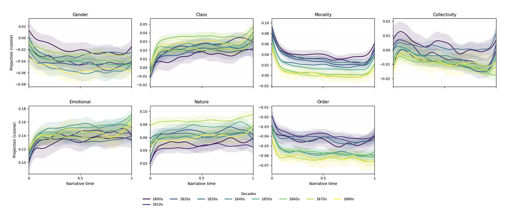
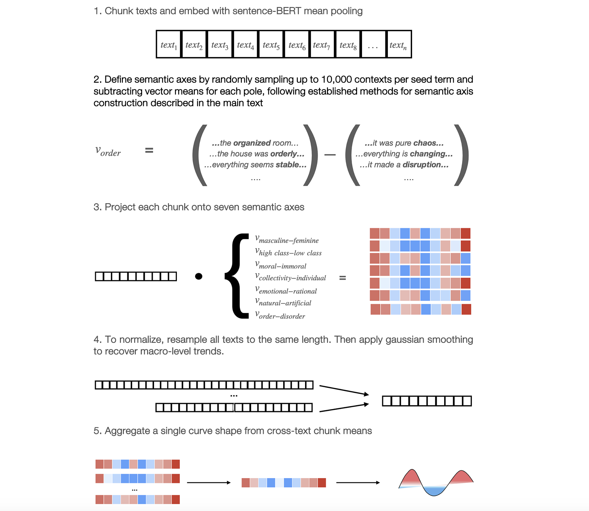
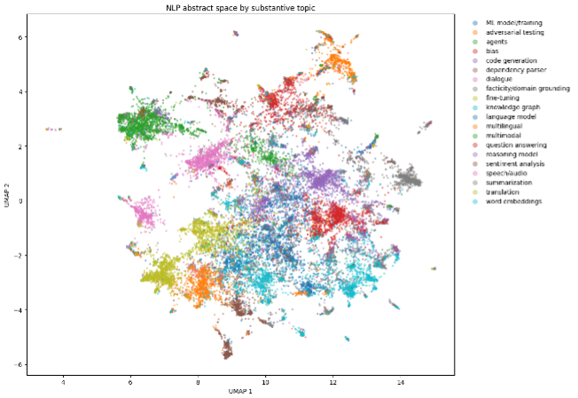
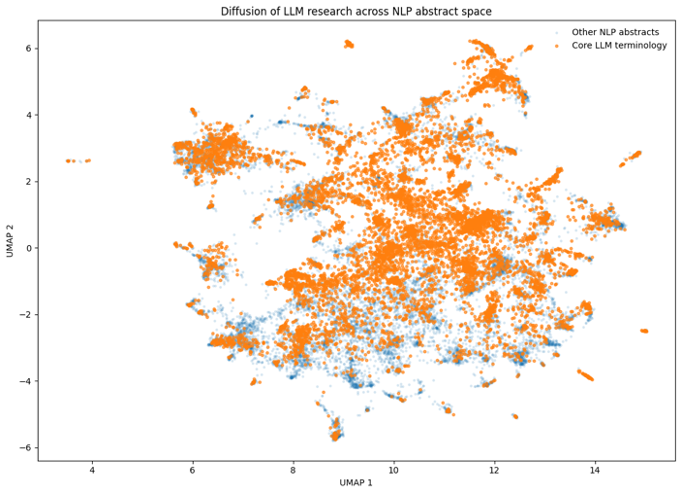
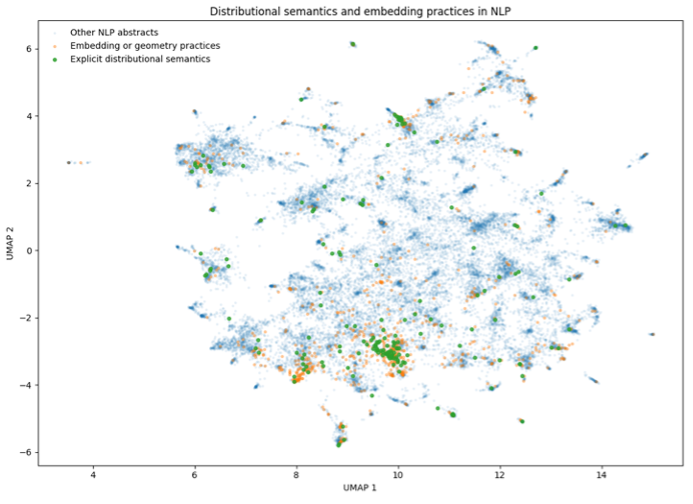

[Research](research.md)     ·     [CV](cv.md)

# Welcome

I am a computational social scientist focused on questions spanning cultural, digital, and comparative/historical sociology. My dissertation approaches the sociology of AI from two connected interdisciplinary angles: 

- Part (1) pursues cultural and archival questions through novel methods for text analysis and natural language processing.

- Part (2) explores the conceptual history and future of AI and society from the perspective of science and technology studies (STS).

Portions of my dissertation project have received R&Rs or are accepted with minor revisions at venues such as Sociological Methods and Research and History and Philosophy of the Life Sciences. My work has been been published in venues such as Computational Humanities Research and the ACM AI Ethics and Society Proceedings.

I additionally received master's degrees in computer science and sociology from Oxford University, where I studied as a Rhodes Scholar, as well as undergraduate degrees in computer science and English literature.

I am always happy to discuss these and related topics! Please get in touch at wrathje@berkeley.edu

---

Papers 

---

Recent work

*Computational narratology with transformer embeddings*

Social scientists have been increasingly using word embeddings to measure semantic associations in text by recovering a direction in embedding space for binary oppositions like gender and quantitatively scoring associated terms along it. Transformer models allow for the embedding of text sequences, up to and including entire books. This paper provides a proof-of-concept that blends semantic axis projection with time series analysis. Books are chunked into sequences, embedded with a transformer sentence embedding model, then projected onto several directions. This method successfully recovers several temporal trends characteristic of historical narrative changes over nearly 3000 full texts.

*Characterizing the field of natural language processing after LLMs*

 

